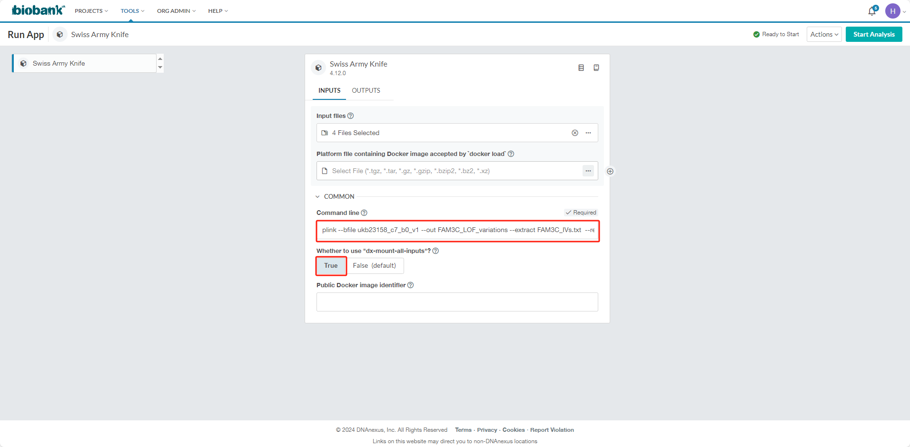
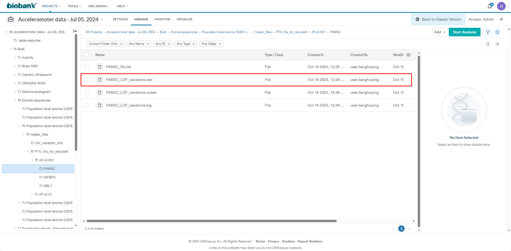

# PTV 遗传干预

## 一些概念

- **蛋白截断变异（protein truncating variants，PTV）**：通常通过提前终止密码子、移码或异常剪接来缩短蛋白质的编码序列，从而导致蛋白功能部分或完全丧失。
- **蛋白改变变异（protein altering variants，PAV）**：PAV包括PTV，还包括错义突变、in-frame mutation等。
- **PTV遗传干预**：PTV和基因敲除是相似的。通过人群层面的外显子测序/全基因组测序数据，得到携带有某个基因PTV的人群，用自然状态下的突变模拟基因敲除、遗传干预的过程。

## 参考资料

- [VEP官网教程](https://useast.ensembl.org/info/docs/tools/vep/script/vep_tutorial.html)：VEP是一种基因注释软件，可以在这里查阅VEP的进一步功能。
- [LOFTEE](https://github.com/konradjk/loftee/tree/grch38)：LOFTEE是VEP的一个插件，可以注释变体是否是lost of function变异。
- [UKB外显子测序1](https://www.ncbi.nlm.nih.gov/pmc/articles/PMC8596853/)：UKB团队外显子测序发表的文章。
- [UKB外显子测序2](https://dnanexus.gitbook.io/uk-biobank-rap/science-corner/whole-exome-sequencing-oqfe-protocol/protocol-for-processing-ukb-whole-exome-sequencing-data-sets)：UKB从测序数据清洗外显子数据的流程，包括OQFE过程、DeepVariant和GLnexus，当我们有外部的外显子数据时，可以通过这些流程和UKB数据进行合并。
- [Circulation上面的一篇文章](https://www.ahajournals.org/doi/10.1161/CIRCULATIONAHA.124.070982?url_ver=Z39.88-2003&rfr_id=ori:rid:crossref.org&rfr_dat=cr_pub%20%200pubmed)：这篇文献方法部分有最详细的PTV遗传干预过程描述。

## 进行PTV遗传干预

### 过程简述

1. 对某个基因阅读框范围内的遗传变异，利用VEP配合LOFTEE插件进行基因注释，注释可靠的功能缺失变异。
2. 在UKB中获取每个个体这些变异的携带情况，最后把UKB人群划分为缺失变异携带者和非携带者。
3. 最后通过cox/KM分析/逻辑回归等方法，探究携带者与非携带者的差异，揭示这个基因的潜在功能。

### 一些注意事项

1. 在HPC服务器上，VEP没有配置成功，**运行需要在科室服务器上面。**
2. 下面的代码适用于GrCh38版本的基因数据，**不适用于GrCh37版本**，若要分析GrCh37版本，需要下载LOFTEE插件的[master branch](https://github.com/konradjk/loftee/tree/master)。另外，UKB的外显子数据是GrCh38版本的（不同于基因型和插补数据的GrCh37版本）。
3. VEP选用的参考序列为来源Ensembl的homo_sapiens_vep_112_GRCh38.tar.gz文件（默认参考），若需分析**其他物种**，或选用**其他参考序列**，请参看VEP官网。

### 操作过程

**下面操作以FAM3C基因为例，做其他基因时，需要替换。**

#### I. 获取研究基因的信息

在[GeneCards](https://www.genecards.org/cgi-bin/carddisp.pl?gene=FAM3C)上面获取FAM3C基因38版本的位置：7号染色体121348878-121396396。


#### II. 获取用于注释的变体清单（vcf文件）

提取时按照UKB质控流程，只有**至少90%的基因型的阅读深度（read depth）大于10的变体**，才进行保留。可参看一下[这里](https://dnanexus.gitbook.io/uk-biobank-rap/science-corner/whole-exome-sequencing-oqfe-protocol/)。
另外，文献中只保留**罕见变异**，选择[基因频率小于0.1%](https://www.ahajournals.org/doi/10.1161/CIRCULATIONAHA.124.070982?url_ver=Z39.88-2003&rfr_id=ori:rid:crossref.org&rfr_dat=cr_pub%20%200pubmed)或者[基因频率小于1%](https://pubmed.ncbi.nlm.nih.gov/37117740/)的变体，因此我们也只保留它们。

1. **检查是否有现成的提取结果**
    登录UKB rap平台，进入“Acceleromoter data - Jul 05, 2024”文件夹，依次点击Bulk→“Exome sequences”→“Population level exome OQFE variants, PLINK format - final release→helper_files”→Chr_variation_info，我把运行结果都储存在这个地方了。
    
    c17_0.001_rare_variations.snplist表示17号染色体上基因频率小于0.1%的变体，而c17_0.01_rare_variations.snplist表示17号染色体上基因频率小于1%的变体。
    **如果有你想要的染色体对应的文件，就不需要再次提取了**，否则按下面的流程进行提取。

2. **提取变体信息**
   如果没有现成的提取结果，以提取UKB中FAM3C所在7号染色体上的变体信息为例。

   **① 点击菜单栏TOOLS，点击Tools library，选择Swiss Army Knife，点击run。**

   

   

   

   **② 选择输出路径，选择我们存放提取结果的地方**

   

   

   

   

   **③ 设置Swiss Army Knife的参数**
   选择输入文件，需要在helper_files中选择ukb23158_500k_OQFE.90pct10dp_qc_variants.txt，以及在“Population level exome OQFE variants, PLINK format - final release”文件夹中选择对应染色体的plink格式文件（c7就表示染色体7，以此类推，注意plink的三种格式文件都要选择，.bed/.bim/.fam文件）。

   

   

   

   

   将下面的代码修改后复制入Command line，一般需要修改染色体编号（例如两处的c7改成cX）和基因频率的过滤条件（--max-maf 0.001表示最大的基因频率时0.1%）

   ```sh
   plink --bfile ukb23158_c7_b0_v1 --out c7_0.001_rare_variations --exclude ukb23158_500k_OQFE.90pct10dp_qc_variants.txt --max-maf 0.001  --keep-allele-order --write-snplist
   ```

   最后选择挂载（dx-mount那里选择True），点击Start Analysis和Launch Analysis。他就会自己开始运行了。

   

   

   

#### III. VEP注释，LOFTEE获取LOF变体

在存放结果的地方下载对应染色体的.snplist文件。在科室服务器创建并进入路径，上传.snplist文件，然后筛选我们研究基因区域的变体，并将其转变为vcf文件。
下面的代码需要修改输入文件名称"c7_0.001_rare_variations.snplist"、输出文件名称"FAM3C.vcf"以及start_pos和end_pos的取值。

```python
# 打开 SNP 列表文件和输出的 VCF 文件
with open("c7_0.001_rare_variations.snplist", "r") as snp_file, open("FAM3C.vcf", "w") as vcf_file:
    # 写入 VCF 文件头部
    vcf_file.write("##fileformat=VCFv4.2\n")
    vcf_file.write("#CHROM\tPOS\tID\tREF\tALT\tQUAL\tFILTER\tINFO\tFORMAT\tSAMPLE\n")
    
    #定义基因区域的起止位点
    start_pos = 121348878
    end_pos = 121396396

    # 逐行读取 SNP 列表
    for line in snp_file:
        # 去掉换行符并分割字段
        chrom, pos, ref, alt = line.strip().split(':')
        pos = int(pos)

        if start_pos <= pos <= end_pos:
            # 写入 VCF 格式的一行
            vcf_file.write(f"{chrom}\t{pos}\t.\t{ref}\t{alt}\t.\tPASS\t.\tGT\t./.\n")

```

然后通过VEP和LOFTEE进行注释，根据你的实际情况修改下面代码中的FAM3C。VEP各项指令的具体含义请参看或者ChatGPT。

```sh
vep -i FAM3C.vcf \
    --cache \
    --sift b \
    --output_file FAM3C_vep.vcf \
    --vcf \
    --canonical \
    --symbol \
    --force_overwrite \
    --dir_plugins /home/linmiao/.vep/Plugins/loftee-grch38 \
    --plugin AlphaMissense,file=/home/linmiao/.vep/Plugins/AlphaMissense_hg38.tsv.gz \
    --plugin LoF,loftee_path:/home/linmiao/.vep/Plugins/loftee-grch38,human_ancestor_fa:/home/linmiao/.vep/Reference/GrCh38/human_ancestor.fa.gz,conservation_file:/home/linmiao/.vep/Reference/GrCh38/loftee.sql,gerp_bigwig:/home/linmiao/.vep/Reference/GrCh38/gerp_conservation_scores.homo_sapiens.GRCh38.bw
```

提出来LOF的变体到一个txt文件，方便后续提取每个个体的变体信息。还是根据你的实际情况修改下面代码中的FAM3C。我们用三种方法进行IV的选取，第一种是LOFTEE预测PTV（对应HC），第二种是AlphaMissense预测损害性的错义突变（对应likely_pathogenic），第三种是SIFT预测损害性的错义突变（对应deleterious）。可以酌情挑选IV进行后续的分析。

```R
library(data.table)
library(tidyverse)

FAM3C <- fread("FAM3C_vep.vcf", header = F)
colnames(FAM3C) <- unlist(FAM3C[1,])
FAM3C <- FAM3C %>% filter(grepl("FAM3C",INFO))
FAM3C_LOFTEE <- FAM3C %>% filter(grepl("HC",INFO))
FAM3C_LOFTEE <- FAM3C_LOFTEE[,c(1:2,4:5)]
names(FAM3C_LOFTEE)[1] <- "CHROM"

#LOFTEE
FAM3C_LOFTEE <- FAM3C_LOFTEE %>% rowwise %>% mutate(variation = paste(CHROM, POS, REF, ALT, sep=":"))
FAM3C_LOFTEE <- FAM3C_LOFTEE %>% select(variation)
fwrite(FAM3C_LOFTEE,"FAM3C_IVs_LOFTEE.txt", col.names = F)

#AlphaMissense
FAM3C_AlphaMissense <- FAM3C %>% filter(grepl("likely_pathogenic",INFO))
FAM3C_AlphaMissense <- FAM3C_AlphaMissense[,c(1:2,4:5)]
names(FAM3C_AlphaMissense)[1] <- "CHROM"
FAM3C_AlphaMissense <- FAM3C_AlphaMissense %>% rowwise %>% mutate(variation = paste(CHROM, POS, REF, ALT, sep=":"))
FAM3C_AlphaMissense <- FAM3C_AlphaMissense %>% select(variation)
fwrite(FAM3C_AlphaMissense,"FAM3C_IVs_AlphaMissense.txt", col.names = F)

#SIFT
FAM3C_SIFT <- FAM3C %>% filter(grepl("\\|deleterious\\(",INFO))
FAM3C_SIFT <- FAM3C_SIFT %>% mutate(INFO = gsub(".*(deleterious\\([0-9]+(\\.[0-9]+)?\\)).*","\\1", INFO))
FAM3C_SIFT <- FAM3C_SIFT %>% mutate(INFO = gsub("deleterious\\(","", INFO))
FAM3C_SIFT <- FAM3C_SIFT %>% mutate(INFO = gsub("\\)","", INFO))
FAM3C_SIFT <- FAM3C_SIFT %>% mutate(INFO = as.numeric(INFO))
FAM3C_SIFT <- FAM3C_SIFT %>% filter(INFO < 0.05)
FAM3C_SIFT <- FAM3C_SIFT[,c(1:2,4:5)]
names(FAM3C_SIFT)[1] <- "CHROM"
FAM3C_SIFT <- FAM3C_SIFT %>% rowwise %>% mutate(variation = paste(CHROM, POS, REF, ALT, sep=":"))
FAM3C_SIFT <- FAM3C_SIFT %>% select(variation)
fwrite(FAM3C_SIFT,"FAM3C_IVs_SIFT.txt", col.names = F)

#All
FAM3C <- rbind(FAM3C_LOFTEE,FAM3C_AlphaMissense, FAM3C_SIFT)
FAM3C <- unique(unlist(FAM3C))
variation_lst <- tibble(FAM3C)
fwrite(variation_lst,"FAM3C_IVs.txt", col.names = F)
```

#### IV. RAP上提取UKB个体的变体信息

   **① 将FAM3C_IVs.txt文件上传到RAP。**
   在“Acceleromoter data - Jul 05, 2024”项目里，你可以自己创建任意的路径上传，你能找到就行。上传这一步不挂梯子很快，挂了很慢很慢。

   

   **② 点击菜单栏TOOLS，点击Tools library，选择Swiss Army Knife，点击run。**

   

   

   

   **③ 选择输出路径** 自由选定就可以滴~

   

   **④ 设置Swiss Army Knife的参数**
   选择输入文件，需要选择FAM3C_IVs.txt文件（你上传的位置找到你的文件~）以及在Bulk→“Exome sequences”→“Population level exome OQFE variants, PLINK format - final release→helper_files”文件夹中选择对应染色体的plink格式文件（c7就表示染色体7，以此类推，注意plink的三种格式文件都要选择，.bed/.bim/.fam文件）。

   

   

   

   将下面的代码修改后复制入Command line，一般需要修改染色体编号（例如两处的c7改成cX）和基因名。

   ```sh
   plink --bfile ukb23158_c7_b0_v1 --out FAM3C_LOF_variations --extract FAM3C_IVs.txt  --recode A
   ```

   最后选择挂载（dx-mount那里选择True），点击Start Analysis和Launch Analysis。他就会自己开始运行了。

   

   

   最后会在输出路径中得到提取结果.raw文件，类似于下面这样：

   

#### V. 遗传干预分析（以逻辑回归为例）

   下载.raw文件，进行下游分析。下面的代码是在HPC上运行的，因为表型和协变量文件在HPC上面，你也可以都在科室服务器上存储和运行（不过科室服务器似乎存储空间快满了）。
   **协变量可以有更多的选择空间**，那篇circulation上面的参考文献使用了sex，age，age^2，基因型的array，基因型的前10个主成分做了协变量，**这些信息在这里`/share/home/zhangjunyu/Rawdata/UKB_GWAS/GWAS_cov.csv`可以找到**。

```R
library(data.table)
library(tidyverse)

#读取数据
phenotype <- fread("/share/home/zhangjunyu/Project/Diabetes_Proteomic_analysis/Result/genetic_intervention/DKD_outcome_complication_baseline_removed.csv")
covariate <- fread("/share/home/zhangjunyu/Project/Diabetes_Proteomic_analysis/Data/covariate/covariate_DKD.csv")
PTV_status <- fread("/share/home/zhangjunyu/Project/Diabetes_Proteomic_analysis/Result/genetic_intervention/FAM3C/FAM3C_LOF_variations.raw")

#提取表型、协变量
phenotype <- phenotype %>% select(eid, target_y)
covariate <- covariate %>% select(eid, age, sex)
#定义PTV携带者
PTV_status <- PTV_status[,-2:-6] 
PTV_status$sum <- rowSums(PTV_status[, -1], na.rm =T)  # -1表示排除第一列 FID
PTV_status <- PTV_status %>% mutate(PTVcarrier = ifelse(sum == 0, 0, 1))
PTV_status <- PTV_status %>% rename(eid = FID)
PTV_status <- PTV_status %>% select(eid, PTVcarrier)
#合并数据
data_all <- inner_join(PTV_status, covariate, by = "eid")
data_all <- inner_join(data_all, phenotype, by = "eid")
#因子变量
data_all = data_all %>% mutate(PTVcarrier = factor(PTVcarrier), sex = factor(sex), target_y = factor(target_y))
#逻辑回归
model <- glm(target_y ~ PTVcarrier + age + sex, data = data_all, family = binomial)
summary(model)
```

### 附录：vep & loftee安装过程可能遇到的问题

1. 在安装VEP时，htslib很容易报错（特别是你在安装各种依赖前进行安装VEP），可以考虑安装各种依赖后，删除htslib文件夹，重新安装VEP。
2. 在使用loftee的时候，提示需要下载Bio::DB::BigFile，下载Bio::DB::BigFile时又需要下载kent/src
但是最新版的kent/src提示无法安装成功，[这里](https://useast.ensembl.org/info/docs/tools/vep/script/vep_download.html#bigfile)的Bio::DB::BigFile部分是解决办法，通过安装3.35版本kent，再进行-fPIC的make安装，可以成功安装Bio::DB::BigFile。
3. LOFTEE的master分支是服务于GrCh37版本的，grch38分支是服务于GrCh38版本的，在这里可以挑选。
   
4. Windows安装很麻烦，没有尝试成功，建议不要尝试。其他大部分问题ChatGPT都可以解决。