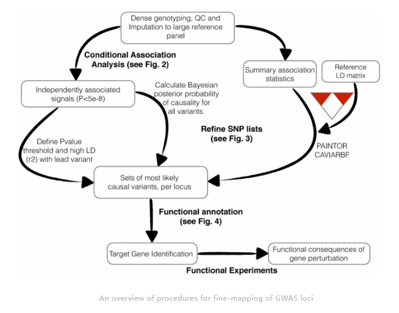
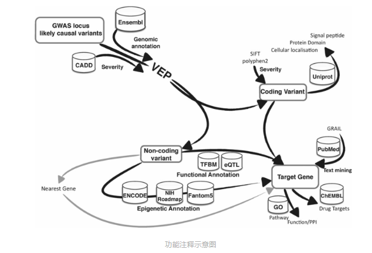

# Fine-mapping

## 参考资料

1. [介绍Fine-mapping综述（Human Molecular Genetics的综述Strategies for fine-mapping complex traits）的推文](https://mp.weixin.qq.com/s/Vj_i7MSRsdN0JGTNTllPWw)

里面有两张非常形象的总结图：




2. [Finemap官方教程](http://www.christianbenner.com/)

3. [参考文献1](https://pmc.ncbi.nlm.nih.gov/articles/PMC10618167/#Sec11)

使用 FINEMAP v1.468 对每个 GWAS 区域进行精细映射。对于每个精细映射的区域，使用来自基因型剂量的 LDstore269 计算样品内连锁不平衡 （LD） 矩阵。基因座中因果变异的最大数量设置为 10。每个精细映射的 GWAS 区域的独立关联信号的数量由 FINEMAP 给出最高后验概率的 CS 中信息可信集 （CS） 的数量决定。如果 CS 变体中的最小 r2 为≥0.1，那么这个CS被认为是informative. 我们从每个 CS 中选择顶部变体来表示关联信号，除非 CS 包含高 LD （r2 > 0.95） 的功能变体与顶部变体，在这种情况下，与顶部变体具有最大 r2 的功能变体被选为代表性变体66.如果未获得信息丰富的 CS，则选择 GWAS 先导变体作为代表性变体。MHC 区域 （chr 6： 25–34 Mb） 被排除在精细定位之外，其中 GWAS 先导变体被定义为代表性变体。

我们优先考虑了在单变量或多变量 GWAS 的精细定位中发现 PIP > 0.5 的功能变异的基因。对于功能变体，我们从 Variant Annotation Integrator71 获得了功能变体分数，从 CADD v1.638 获得了 CADD 分数。

4. [参考文献2](https://www.nature.com/articles/s41588-022-01025-y#Sec9)

参数优化
FINEMAP 和 CAVIARBF 对效应大小的先验标准差使用不同的默认值 （FINEMAP， 0.05;CAVIARBF， 0.1281429）。我们调整了不同的先验值 \（\in\）{0.05， 0.12， 0.2， 0.3， 0.4， 0.5， 1， 根据数据本身计算}，并观察到不同的值严重影响了 QTL 的精细定位结果;然而，在 IMD 中没有观察到显著差异（补充图6a-d）。因此，我们将 QTL 的可接受先验设置为 0.3，并保持 IMD 的 CAVIARBF 默认值 （0.1281429）。
为了确定每个基因座的潜在因果变异，我们分别为 QTL 和 IMD 创建了 95% CS，假设每个基因座有一个因果变异。对于每个精细定位实验，我们通过按递减的精细定位后验概率 （PPfm），并选择共同占 ≥95% PPfm 的最小变体集.


## 实操

### 提取SNP的清单

```python
import gwaslab as gl
import pandas as pd

#选定染色体区域，我们会选择SNP附近1MB的区域，如果两个SNP的区域有重叠，我们会做适当的合并
CHR = 18
#总区域，开头的SNP是SNP_POS1，结尾的SNP是SNP_POS2
SNP_POS1 = 71684250
SNP_POS2 = 71684250
#上下游各500kb，合计1MB，可以调整
Start = SNP_POS1 - 500000
End = SNP_POS2 + 500000

#读取GWAS文件
mysumstats = gl.Sumstats("/share/home/zhangjunyu/Project/240925_HF/Result/GWAS/Renal_injury_before_HF/GWAS.vcf", fmt = "vcf", build="19") #读取数据
mysumstats.basic_check() #标准化数据
#提取目标区域内的SNP清单
GWAS_data = mysumstats.data
GWAS_data = GWAS_data[GWAS_data['CHR']==CHR]
GWAS_data = GWAS_data[(GWAS_data['POS'] > Start) & (GWAS_data['POS'] < End)]
#输出这个清单
GWAS_data[['rsID']].to_csv('/share/home/zhangjunyu/Project/240925_HF/Result/GWAS/Renal_injury_before_HF/06.Finemapping/rs575938304/snp_output.txt', sep = "\t", index=False, header=False)
```

**运行结束不要关闭，还要再运行呢**

### 计算LD matrix

```sh
# 提取R2的LD-matrix
cd /share/home/zhangjunyu/Project/240925_HF/Result/GWAS/Renal_injury_before_HF/06.Finemapping/rs575938304
plink2 --pfile /share/home/zhangjunyu/Project/240925_HF/Result/GWAS/Renal_injury_before_HF/02.GWAS_QC/GWAS_QC --extract snp_output.txt --make-pgen --out extracted_data
plink2 --pfile extracted_data --r-phased square --out ld_matrix
```

finemap需要文件以空格作为分隔符，所以我们需要修改一下。

```python
#把.phased.vcor1结尾的结果移动到工作路径，然后改成.ld后缀的文件名,同时把tap分隔符改成空格
input_file = 'ld_matrix.phased.vcor1'
output_file = 'GWAS.ld'

with open(input_file, 'r') as infile, open(output_file, 'w') as outfile:
    for line in infile:
        # 用空格替换制表符并写入新文件
        outfile.write(line.replace('\t', ' '))

quit()
```

### 制作.z文件

提取.phased.vcor1.vars的SNP，制作.z文件，回到最开始的python

```python
SNP_lst = pd.read_csv("/share/home/zhangjunyu/Project/240925_HF/Result/GWAS/Renal_injury_before_HF/06.Finemapping/rs575938304/ld_matrix.phased.vcor1.vars", header = None)
SNP_lst.columns = ['rsID']
filtered_data = GWAS_data[GWAS_data['rsID'].isin(SNP_lst['rsID'])]
formatted_data = filtered_data[['rsID', 'CHR', 'POS', 'EA', 'NEA', 'EAF', 'BETA', 'SE']].copy()
formatted_data.columns = ['rsid', 'chromosome', 'position', 'allele1', 'allele2', 'maf', 'beta', 'se']
formatted_data.to_csv("/share/home/zhangjunyu/Project/240925_HF/Result/GWAS/Renal_injury_before_HF/06.Finemapping/rs575938304/GWAS.z", sep = " ", index = False)
```

### 运行finemap

```sh
cp /share/home/zhangjunyu/Practice/241023_finemap/finemap/data /share/home/zhangjunyu/Project/240925_HF/Result/GWAS/Renal_injury_before_HF/06.Finemapping/rs575938304
finemap --sss --in-files data --dataset 1
```

到这里就结束啦~
------------
