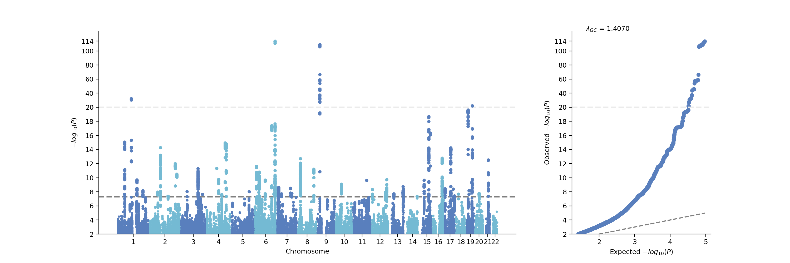
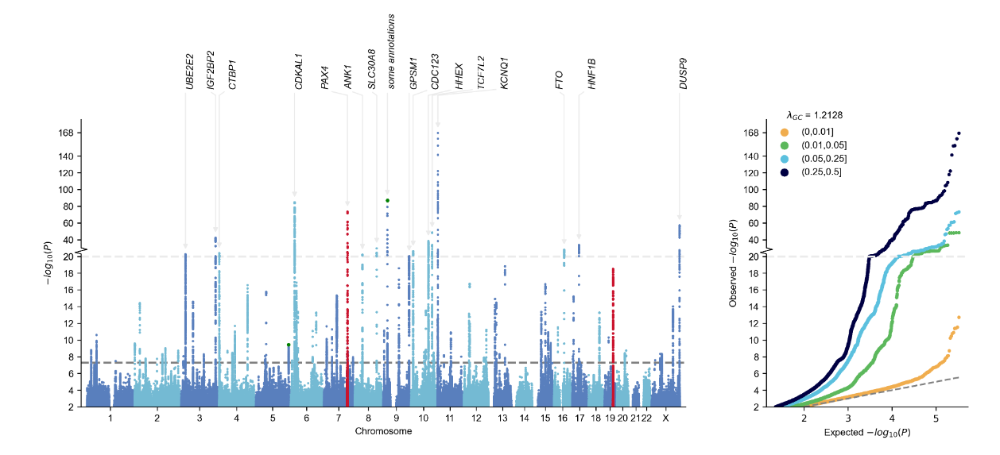
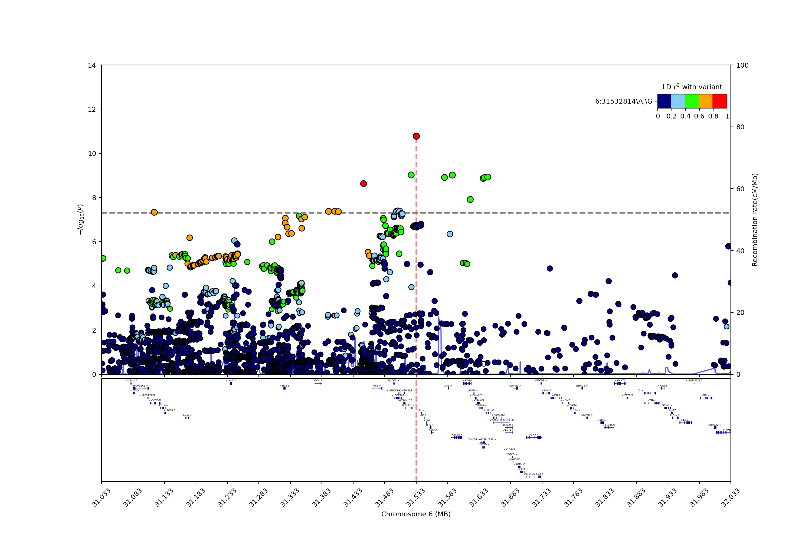
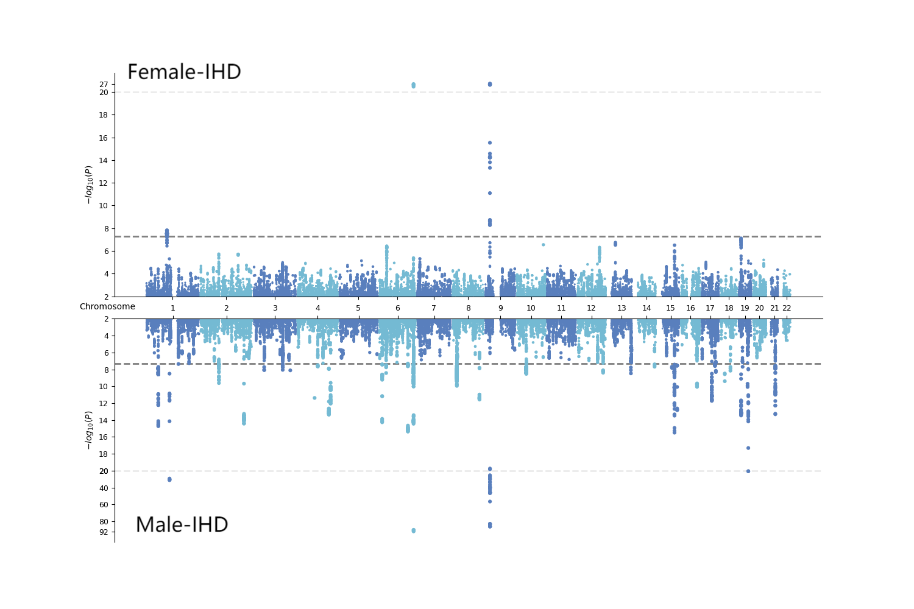
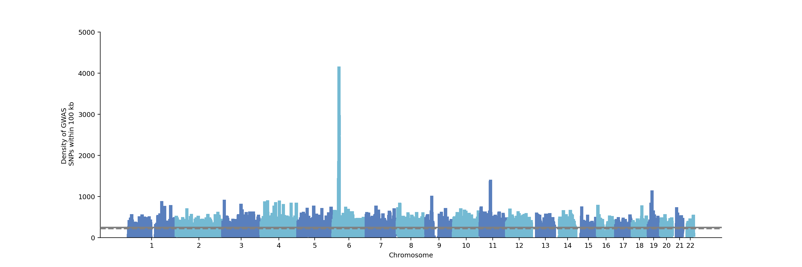

# 使用UKB数据进行GWAS

## 一些参考

推荐在进行GWAS和PRS前或进行中遇到问题时，浏览下面的网站，加深对每个环节的理解。

1. **GWAS和PRS教程**（包含QC、PCA的过程）

- [GWAS的参考教程1](https://cloufield.github.io/GWASTutorial/)
- [GWAS的参考教程2](https://plink.readthedocs.io/en/latest/GWAS/)
- [GWAS结果可视化参考教程](https://cloufield.github.io/gwaslab/Visualization/)
- [PRS的参考教程](https://choishingwan.github.io/PRS-Tutorial/)
- [ldsc计算遗传力的参考教程](https://github.com/bulik/ldsc/wiki/Heritability-and-Genetic-Correlation)
- [PRSice-2计算PRS](https://choishingwan.github.io/PRSice/)
- [SCT计算PRS](https://privefl.github.io/bigsnpr/articles/SCT.html)
- [LDpred2、lassosum2计算PRS](https://privefl.github.io/bigsnpr/index.html)
- [lassosum计算PRS](https://github.com/tshmak/lassosum#lassosum-)

2. **plink输出格式**（查询特定后缀文件的列名是什么含义）

- [plink1.9输出文件的格式](https://www.cog-genomics.org/plink/1.9/formats)
- [plink2输出文件的格式](https://www.cog-genomics.org/plink/2.0/formats)

3. **UKB中个体Genotype数据采集、插补及QC过程**

- [Genome-wide genetic data on ~500,000 UK Biobank participants](https://www.biorxiv.org/content/10.1101/166298v1)
   UKB插补时进行了初步的QC，包括MAF<0.0001，缺失超过5%等等，我们在进行GWAS、PRS时可以进一步进行QC。

## 现有数据

1. **UKB个体Genotype插补数据：**`/share/home/longxinyang/bio/2023_ukb/imputation/`
   插补数据中的性别采用的是基因判别的性别（Genetic sex），并非自我报告的性别，因此我认为质控过程不需要check sex。
2. **基因型插补质量INFO：**`/share/home/zhangjunyu/Rawdata/UKB_GWAS/Imputation_INFO/`
   在每份数据中，第8列是INFO分数。
3. **UKB基因组协变量文件：**`/share/home/zhangjunyu/Rawdata/UKB_GWAS/GWAS_cov.csv`
    包括基因型检测的batch、plate、well，基因判别的性别，kinship亲属关系，基因判别的人种，异常值人员，和40个PCA主成分的数据。
4. **UKB计算基因型PCA采用的个体清单：**`/share/home/zhangjunyu/Rawdata/UKB_GWAS/22020_sample_use_in_PCA.txt`
    UKB挑选了407,219个没有亲属、数据缺失少的个体进行PCA分析。注意，UKB做PCA的时候没有筛选人种，它的PCA结果能揭示人种的异质性。

---

## 使用HPC进行GWAS

### 数据准备

1. **待提取个体文件**
    将进行**GWAS**的个体编号总结在一份.txt文件中，需要两列编号，列名为"FID"和"IID"，格式如下：

    ```sh
    FID	IID
    1000619	1000619
    1003210	1003210
    1004545	1004545
    1004716	1004716
    1005251	1005251
    1007707	1007707
    1008517	1008517
    1009506	1009506
    1009521	1009521
    ```

    **设置提取个体文件的路径：**

    ```sh
    #举一个例子，下面这个all_IID.txt是所有白人，要替换成自己的文件
    Inclusion="/share/home/zhangjunyu/Project/240721_IHD_GWAS/Data/Inclusion/All_IID.txt"
    ```

2. **表型文件**
   整理表型数据到一份.txt文件中。表型文件固定前两列为个体编号，列名为"FID"和"IID"，第三列或其他列为表型。
   - 连续变量作为表型，格式如下：

    ```sh
    FID	IID	pheno
    1000619	1000619	56.1603
    1003210	1003210	76.1989
    1004545	1004545	69.6949
    1004716	1004716	66.5986
    1005251	1005251	58.7845
    1007707	1007707	55.6963
    1008517	1008517	58.7492
    1009506	1009506	23.5583
    1009521	1009521	66.5572
    ```
 
   - 二分类变量作为表型，**注意：二分类性状中1表示control，2表示case**，格式如下：

    ```sh
    FID	IID	pheno
    1000038	1000038	1
    1000093	1000093	1
    1000108	1000108	2
    1000115	1000115	1
    1000151	1000151	1
    1000166	1000166	2
    1000173	1000173	1
    1000182	1000182	1
    1000201	1000201	1
    ```

    - 多分类变量利用plink实现似乎有些困难，可以参考[其他软件/包](https://blog.sciencenet.cn/blog-3423233-1281079.html)来实现。

    **设置表型文件的路径：**

    ```sh
    #举一个例子，下面这个all_IID.txt是是否患IHD的二元分类性状，要替换成自己的文件
    Pheno="/share/home/zhangjunyu/Project/240721_IHD_GWAS/Data/Phenotype/All_IHD.txt"
    ```

### 进行GWAS

1. **创建工作路径，进入工作路径**

    ```sh
    workdir="/share/home/zhangjunyu/Project/240721_IHD_GWAS/Result/All"
    cd ${workdir}
    ```

2. **提取进行GWAS分析的个体**
    通过代码自动生成并提交LSF任务。提取目标个体，将每个染色体bgen原始数据转换为plink2的pgen格式。这是在新阳师姐代码基础上改动的，还没有得到师姐授权（小声）。

    ```sh
    #!/bin/bash
    #创建目标文件夹
    Filefold1="01.Extract_participants"
    mkdir -p ${Filefold1}
    #定义所有染色体标记，开始循环
    chromosomes=( {1..22} X XY )

    for chr in "${chromosomes[@]}"; do
        #生成脚本文件名
        file1="${Filefold1}/chr${chr}_subsample.sh"
        #写入内容到脚本文件
        cat <<EOF > "$file1"
    #!/bin/bash
    #BSUB -J chr$chr
    #BSUB -n 40
    #BSUB -R "span[ptile=40]"
    #BSUB -o output_%J
    #BSUB -e output_%J
    #BSUB -q mpi

    cd ${workdir}

    # 将bgen转换为pgen，并挑选目标人群
    genotypeFile="/share/home/longxinyang/bio/2023_ukb/imputation/ukb22828_c${chr}_b0_v3.bgen"
    sample="/share/home/longxinyang/bio/2023_ukb/imputation/ukb22828_c${chr}_b0_v3.sample"

    /share/home/zhangjunyu/Software/plink/plink2/plink2 \
    --memory 409600 --threads 35 \
    --bgen "\${genotypeFile}" 'ref-first' --sample "\${sample}" \
    --snps-only \
    --keep "${Inclusion}" \
    --rm-dup 'force-first' \
    --make-pgen --out "./${Filefold1}/ukb22828_c${chr}_subsample"
    
    EOF

        # 为生成的脚本文件设置执行权限
        chmod +x "$file1"
        # 提交任务
        bsub < "$file1"
    done

    echo "所有脚本已生成并完成提交。"
    ```

3. **合并基因型数据**
    将提取得到的1-22号染色体数据合并，生成plink格式的.bed文件。这个也是在新阳师姐代码基础上改动的，还没有得到师姐授权（小声）。

    ```sh
    #创建目标文件夹
    Filefold2="02.Merge_chromosome"
    mkdir -p ${Filefold2}
    #生成目标脚本
    file2="02.merge_chr1_22.sh"
    cat <<EOF > "$file2"
    #!/bin/bash
    #BSUB -J GWAS_merge
    #BSUB -n 40
    #BSUB -R "span[ptile=40]"
    #BSUB -o output_%J
    #BSUB -o output_%J
    #BSUB -q mpi

    cd ${workdir}

    # 生成pgen.list记录要合并的文件的前缀
    output_file="pgen.list"
    chromosomes=( {1..22}  )

    # chromosomes=(19 21)
    > "\$output_file"
    for chr in "\${chromosomes[@]}"; do
        echo "ukb22828_c\${chr}_subsample" >> "\$output_file"
    done

    # 合并所有常染色体的pgen，生成.bed文件
    /share/home/zhangjunyu/Software/plink/plink2/plink2 \
    --memory 2000000 --threads 40 \
    --pmerge-list-dir ./01.Extract_participants \
    --pmerge-list pgen.list \
    --make-bed \
    --out ./${Filefold2}/merge
    EOF

    # 为生成的脚本文件设置执行权限
    chmod +x "$file2"
    # 提交任务
    bsub < "$file2"
    ```

4. **进行GWAS质控**

    ```sh
    #创建目标文件夹
    Filefold3="03.GWAS_QC"
    mkdir -p ${Filefold3}
    #生成目标脚本
    file3="03.GWAS_QC.sh"
    cat <<EOL > "$file3"
    #!/bin/bash
    #BSUB -J GWAS_QC
    #BSUB -n 40
    #BSUB -R "span[ptile=40]"
    #BSUB -o output_%J
    #BSUB -o output_%J
    #BSUB -q mpi

    cd ${workdir}
    
    #根据基因频率、缺失情况、hwe质控，这里的阈值都可以自行调整
    /share/home/zhangjunyu/Software/plink/plink2/plink2 \
        --memory 2000000 --threads 40 \
        --bfile ./02.Merge_chromosome/merge \
        --maf 0.01 \
        --geno 0.02 \
        --mind 0.02 \
        --hwe 1e-6 \
        --make-bed \
        --out ./${Filefold3}/QC1

    #计算F系数筛掉杂合性异常的样本，计算前先进行pruning
    /share/home/zhangjunyu/Software/plink/plink2/plink2 \
        --memory 2000000 --threads 40 \
        --bfile ./${Filefold3}/QC1 \
        --indep-pairwise 50 5 0.2 \
        --out ./${Filefold3}/QC1

    #计算F系数筛掉杂合性异常的样本
    /share/home/zhangjunyu/Software/plink/plink2/plink2 \
        --memory 2000000 --threads 40 \
        --bfile ./${Filefold3}/QC1 \
        --extract ./${Filefold3}/QC1.prune.in \
        --het \
        --out ./${Filefold3}/QC2
    
    #用R筛选F系数属于mean±3SD之外的个体
    /share/home/zhangjunyu/anaconda3/envs/PRS/bin/Rscript Inbreeding_F-coefficient_exclusion.R

    #筛除F系数属于mean±3SD之外的个体
    /share/home/zhangjunyu/Software/plink/plink2/plink2 \
        --memory 2000000 --threads 40 \
        --bfile ./${Filefold3}/QC1 \
        --remove ./${Filefold3}/QC2.sample \
        --keep-allele-order \
        --make-bed \
        --out ./${Filefold3}/QC2

    #去除一级亲属关系（阈值kinship=0.177）的个体
    /share/home/zhangjunyu/Software/plink/plink2/plink2 \
        --memory 2000000 --threads 40 \
        --bfile ./${Filefold3}/QC2 \
        --king-cutoff 0.177 \
        --make-bed \
        --out ./${Filefold3}/QC3    
    EOL

    file_R="Inbreeding_F-coefficient_exclusion.R"
    cat <<EOS > "$file_R"
    library(data.table)
    library(tidyverse)
    het <- fread('03.GWAS_QC/QC2.het')
    mean_F <- mean(het\$F, na.rm=T)
    sd_F <- sd(het\$F, na.rm = TRUE)
    sample <- het %>% filter(F > mean_F + 3*sd_F | F < mean_F - 3*sd_F)
    sample <- sample[,1:2]
    fwrite(sample,'03.GWAS_QC/QC2.sample',row.names=F,col.names=F,sep='\\t')
    EOS

    # 为生成的脚本文件设置执行权限
    chmod +x "$file3"
    # 提交任务
    bsub < "$file3"
    ```

5. **PCA及协变量文件构建**

    ```sh
    # 创建目标文件夹
    Filefold4="04.PCA"
    mkdir -p ${Filefold4}
    #生成目标脚本
    file4="04.GWAS_PCA.sh"
    cat <<EOF > "$file4"
    #!/bin/bash
    #BSUB -J GWAS_QC
    #BSUB -n 40
    #BSUB -R "span[ptile=40]"
    #BSUB -o output_%J
    #BSUB -o output_%J
    #BSUB -q mpi

    cd ${workdir}
    #去除high-LD或HLA区域的SNP
    #因为UKB使用的是hg19版本的基因，所以我们使用了high-ld-hg19.txt，如果是hg38版本，请使用high-ld-hg38.txt
    /share/home/zhangjunyu/Software/plink/plink/plink \
        --bfile ./03.GWAS_QC/QC3 \
        --make-set /share/home/zhangjunyu/Rawdata/UKB_GWAS/high-ld-hg19.txt \
        --write-set \
        --out ./${Filefold4}/hild
    
    #进一步进行pruning，挑选合适的SNP
    /share/home/zhangjunyu/Software/plink/plink2/plink2 \
        --memory 2000000 --threads 40 \
        --bfile ./03.GWAS_QC/QC3 \
        --maf 0.01 \
        --exclude ./${Filefold4}/hild.set \
        --indep-pairwise 500 50 0.2 \
        --out ./${Filefold4}/PCA

    #挑选进行PCA的个体，去除相关联的个体（阈值kinship=0.0884）
    /share/home/zhangjunyu/Software/plink/plink2/plink2 \
        --memory 2000000 --threads 40 \
        --bfile ./03.GWAS_QC/QC3 \
        --extract ./${Filefold4}/PCA.prune.in \
        --king-cutoff 0.0884 \
        --out ./${Filefold4}/PCA

    #对挑选后的SNP以及个体进行PCA
    /share/home/zhangjunyu/Software/plink/plink2/plink2 \
        --memory 2000000 --threads 40 \
        --bfile ./03.GWAS_QC/QC3 \
        --keep ./${Filefold4}/PCA.king.cutoff.in.id \
        --extract ./${Filefold4}/PCA.prune.in \
        --freq counts \
        --pca approx allele-wts 10 \
        --out ./${Filefold4}/PCA
    
    #将PCA模型映射到所有数据，获取每个个体的PCA主成分取值
    /share/home/zhangjunyu/Software/plink/plink2/plink2 \
        --memory 2000000 --threads 40 \
        --bfile ./03.GWAS_QC/QC3 \
        --read-freq ./${Filefold4}/PCA.acount \
        --score ./${Filefold4}/PCA.eigenvec.allele 2 6 header-read no-mean-imputation variance-standardize \
        --score-col-nums 7-16 \
        --out ./${Filefold4}/PCA_projected
    EOF

    # 为生成的脚本文件设置执行权限
    chmod +x "$file4"
    # 提交任务
    bsub < "$file4"
    ```

    构建GWAS协变量文件。在这里，选取性别、年龄、PCA的前十主成分作为协变量，也有文章采用batch等作为协变量，需要具体情况具体探讨。

    ```R
    library(data.table)
    library(tidyverse)
    covariate <- fread("/share/home/zhangjunyu/Rawdata/UKB_GWAS/GWAS_PCA.csv", select=c("eid", "Genetic_sex", "age"))
    covariate <- covariate %>% rename(IID="eid")
    column_names <- fread("./04.PCA/PCA_projected.sscore", nrows = 10) %>% names()
    column_names <- grep("IID|^PC", column_names, value = TRUE)
    PCA <- fread("./04.PCA/PCA_projected.sscore",select=column_names)
    covariate_merge <- right_join(covariate, PCA, by = "IID")
    covariate_merge <- covariate_merge %>% mutate(FID=IID)
    covariate_merge <- covariate_merge[,c(14,1:13)]
    fwrite(covariate_merge,"GAWS_cov.txt", row.names=F, quote=F, sep="\t")
    ```

6. **进行GWAS分析**

   - 对于连续变量，采用如下代码：

    ```sh
    Filefold5="05.GWAS"
    mkdir -p ${Filefold5}
    file5="05.GWAS.sh"
    cat <<EOF > "$file5"
    #!/bin/bash
    #BSUB -J GWAS_QC
    #BSUB -n 40
    #BSUB -R "span[ptile=40]"
    #BSUB -o output_%J
    #BSUB -o output_%J
    #BSUB -q mpi

    cd ${workdir}

    /share/home/zhangjunyu/Software/plink/plink2/plink2 \
        --memory 500000 --threads 40 \
        --bfile ./03.GWAS_QC/QC3 \
        --pheno ${Pheno} \
        --pheno-col-nums 3 \
        --covar GAWS_cov.txt \
        --covar-col-nums 3-14 \
        --no-input-missing-phenotype \
        --covar-variance-standardize \
        --linear \
        --out ./${Filefold5}/GWAS
    EOF

    # 为生成的脚本文件设置执行权限
    chmod +x "$file5"
    # 提交任务
    bsub < "$file5"
    ```

    - 对于二分类变量采用如下代码：

    ```sh
    Filefold5="05.GWAS"
    mkdir -p ${Filefold5}
    file5="05.GWAS.sh"
    cat <<EOF > "$file5"
    #!/bin/bash
    #BSUB -J GWAS
    #BSUB -n 40
    #BSUB -R "span[ptile=40]"
    #BSUB -o output_%J
    #BSUB -o output_%J
    #BSUB -q mpi
    
    cd ${workdir}

    /share/home/zhangjunyu/Software/plink/plink2/plink2 \
        --memory 500000 --threads 40 \
        --bfile ./03.GWAS_QC/QC3 \
        --pheno ${Pheno} \
        --pheno-col-nums 3 \
        --covar GAWS_cov.txt \
        --covar-col-nums 3-14 \
        --no-input-missing-phenotype \
        --covar-variance-standardize \
        --logistic \
        --out ./${Filefold5}/GWAS
    EOF

    # 为生成的脚本文件设置执行权限
    chmod +x "$file5"
    # 提交任务
    bsub < "$file5"
    ```

- **上述代码中` --pheno-col-nums 3 `设置了表型是Pheno文件的第3列，` --covar-col-nums 3-14 `设置了协变量是Covar文件的第3-14列**。这些设置需要根据实际情况调整。

7. **提取最终的GWAS结果**

   - 对于连续变量，找到".glm.linear"后缀的文件（下面的文件名需要替换为自己的文件），采用如下代码：

    ```sh
    head -n 1 ./05.GWAS/GWAS.pheno.glm.linear > GWAS.txt
    grep "ADD" ./05.GWAS/GWAS.pheno.glm.linear >> GWAS.txt
    ```

   - 对于二分类变量，找到".glm.logistic.hybrid"后缀的文件（下面的文件名需要替换为自己的文件），采用如下代码：

    ```sh
    head -n 1 ./05.GWAS/GWAS.pheno.glm.logistic.hybrid > GWAS.txt
    grep "ADD" ./05.GWAS/GWAS.pheno.glm.logistic.hybrid >> GWAS.txt
    ```

    **注意：UKB最终的GWAS数据，经过核实，是GRCh37（hg19）版本的数据。**

### GWAS可视化

0. **首先创建可视化结果存储文件夹，并进行数据读取**

- 对于连续变量：

    ```sh
    Filefold6="06.GWAS_plot"
    mkdir -p ${Filefold6}
    conda activate /share/home/zhangjunyu/anaconda3/envs/gwaslab
    cd ${workdir}
    python    
    ```

    ```python
    import gwaslab as gl
    mysumstats = gl.Sumstats("GWAS.txt", fmt = "plink2_linear", build="19") #读取数据
    mysumstats.basic_check() #标准化数据
    #将P值转变为-log10(P)
    mysumstats.fill_data(to_fill=["MLOG10P"], extreme=True)    
    ```

- 对于二分类变量：

    ```sh
    Filefold6="06.GWAS_plot"
    mkdir -p ${Filefold6}
    conda activate /share/home/zhangjunyu/anaconda3/envs/gwaslab
    cd ${workdir}
    python    
    ```

    ```python
    import gwaslab as gl
    mysumstats = gl.Sumstats("GWAS.txt", fmt = "plink2_logistic", build="19") #读取数据
    mysumstats.basic_check() #标准化数据
    #将P值转变为-log10(P)
    mysumstats.fill_data(to_fill=["MLOG10P"], extreme=True)
    ```

接下来，我们**继续**借助gwaslab包进行可视化，完成包括曼哈顿图在内的多种可视化操作。

1. **Manhattan plot and QQ plot**

    ```python
    import matplotlib.pyplot as plt
    mysumstats.plot_mqq(skip=2, cut=20) #skip设置，进行保留-log10(P) > 2的SNP
    plt.savefig('06.GWAS_plot/Manhattan_plot')
    ```

    

    gwaslab可以实现更加精细的可视化，如下。详情参看[gwaslab可视化](https://cloufield.github.io/gwaslab/Visualization/)。
    

2. **Regional plots**
    区域图能显示某条染色体某段区域上SNP的情况。

    ```python
    import matplotlib.pyplot as plt
    mysumstats.plot_mqq(mode="r", region=(6,31032814,32032814), vcf_path="/share/home/zhangjunyu/.gwaslab/EUR.ALL.split_norm_af.1kgp3v5.hg19.vcf.gz") #在region这里设置画图的染色体区域
    plt.savefig('06.GWAS_plot/Regional_plot')
    ```

    

3. **Miami plot**

    Miami plot 是一种特殊形式的曼哈顿图，通常用于比较**两组数据**的基因组分布。Miami plot 通过在一个图中同时显示两个不同数据集的统计显著性，帮助研究人员**比较和分析这些数据集之间的相似性和差异性**。

    ```python
    import gwaslab as gl
    import matplotlib.pyplot as plt
    sumstats1 = gl.Sumstats("/share/home/zhangjunyu/Project/240721_IHD_GWAS/Result/GWAS/Female/GWAS_Female_IHD.txt", fmt = "plink2_logistic", build="19") #读取数据1
    sumstats2 = gl.Sumstats("/share/home/zhangjunyu/Project/240721_IHD_GWAS/Result/GWAS/Male/GWAS_Male_IHD.txt", fmt = "plink2_logistic", build="19") #读取数据2
    gl.plot_miami2(path1 = sumstats1, path2 = sumstats2, skip=2, cut1=20, cut2=20)
    plt.savefig('06.GWAS_plot/Miami_plot')
    ```

    

4. **Brisbane plot**
    布里斯班图是一个散点图，显示了每个变体的信号密度（参考变体的侧翼区域内的变体数量），这对于呈现从复杂特征的大规模 GWAS 中获得的独立信号非常有用。

    ```python
    import matplotlib.pyplot as plt
    mysumstats.plot_mqq(mode="b", bwindowsizekb=100)
    plt.savefig('06.GWAS_plot/Brisbane_plot')
    ```

    

---